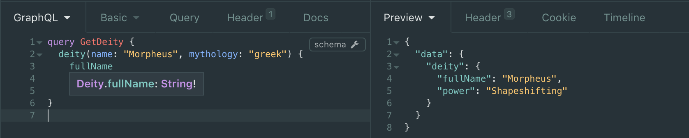

# Morpheus GraphQL

Build GraphQL APIs with your favourite functional language!

Morpheus GraphQL helps you to build GraphQL APIs in Haskell with native haskell types.
Morpheus will convert your haskell types to a GraphQL schema and all your resolvers are just native Haskell functions.

Morpheus is still in an early stage of development, so any feedback is more than welcome, and we appreciate any contribution!
Just open an issue here on GitHub, or join [our Slack channel](https://morpheus-graphql-slack-invite.herokuapp.com/) to get in touch.

## Getting Started
### Setup

To get started with Morpheus, you first need to add it to your project's dependencies, as follows (assuming you're using hpack):

package.yml
```yaml
dependencies:
  - morpheus-graphql
```


Additionally, you should tell stack which version to pick:

stack.yml
```yaml
resolver: lts-12.0 # or greater
extra-deps:
  - morpheus-graphql-0.0.1
```

As Morpheus is quite new, make sure stack can find morpheus-graphql by running `stack update`

### Building your first API
To define a GraphQL API with Morpheus we start by defining the API Schema as a native Haskell data type,
 which derives the `Generic`and `GQLQuery` typeclasses. Lazily resolvable fields on this `Query` type are defined via the infix type `::->`,
 representing resolving a set of arguments `()` to a concrete value.

```haskell
data Query = Query
  { deity :: DeityArgs ::-> Deity
  } deriving (Generic, GQLQuery)

data Deity = Deity
  { fullName :: Text         -- Non-Nullable Field
  , power    :: Maybe Text   -- Nullable Field
  } deriving (Generic, GQLType, FromJSON)

type instance KIND Deity = OBJECT


data DeityArgs = DeityArgs
  { name      :: Text        -- Required Argument
  , mythology :: Maybe Text  -- Optional Argument
  } deriving (Generic, GQLArgs)
```

For each field in the `Query` type defined via `::->` (like `deity`) we will define a resolver implementation that provides the values during runtime by referring to
some data source, e.g. a database or another API. Fields that are defined without `::->` you can just provide a value.

```haskell
resolveDeity :: DeityArgs ::-> Deity
resolveDeity = Resolver $ \args -> askDB (name args) (mythology args)

askDB :: Text -> Maybe Text -> IO (Either String Deity)
askDB = ...
```
Note that the infix type `a ::-> b` is just syntactic sugar for `Resolver (a -> IO (Either String b))`


To make this `Query` type available as an API, we define a `GQLRoot` and feed it to the Morpheus `interpreter`. A `GQLRoot` consists
of `query`, `mutation` and `subscription` definitions, while we omit the latter for this example:

```haskell
gqlApi :: ByteString -> IO ByteString
gqlApi = interpreter
    GQLRoot {
      query = Query {
        deity = resolveDeity
      },
      mutation = (),
      subscription = ()
    }
```
As you can see, the API is defined as `ByteString -> IO ByteString` which we can either invoke directly or use inside an arbitrary web framework
such as `scotty` or `serverless-haskell`. We'll go for `scotty` in this example:
```haskell
main :: IO ()
main = scotty 3000 $ post "/api" $ raw =<< (liftIO . gqlApi =<< body)
```
If we now send a POST request to `http://localhost:3000/api` with a GraphQL Query as body for example in a tool like `Insomnia`:
```GraphQL
query GetDeity {
  deity (name: "Morpheus") {
    fullname
    power
  }
}
```
our query will be resolved!
```JSON
{
  "data": {
    "deity": {
      "fullname": "Morpheus",
      "power": "Shapeshifting"
    }
  }
}
```
## Serverless Example

If you are interested in creating a `Morpheus GraphQL` API with `Serverless`, you should take a look at our example in this repository:
[_Mythology API_](https://github.com/morpheusgraphql/mythology-api) it is our example project build with `Morpheus GraphQL` and `Serverless-Haskell`,
where you can query different mythology characters with `GraphiQL`.

Mythology API is deployed on : [_api.morpheusgraphql.com_](https://api.morpheusgraphql.com) where you can test it with `GraphiQL`


## Advanced topics
### Enums
You can use Union Types as Enums, but they're not allowed to have any parameters.
```haskell
data City
  = Athens
  | Sparta
  | Corinth
  | Delphi
  | Argos
  deriving (Generic, GQLType)

type instance KIND City = ENUM
```

### Scalar types
To use custom scalar types, you need to provide implementations for `parseValue` and `serialize` respectively.
```haskell
data Odd = Int deriving (Generic, GQLType)

instance GQLScalar Odd where
  parseValue (Int x) = pure $ Odd (...  )
  parseValue (String x) = pure $ Odd (...  )
  serialize  (Odd value) = Int value

type instance KIND Odd = SCALAR
```

### Introspection
Morpheus converts your schema to a GraphQL introspection automatically. You can use tools like `Insomnia` to take a
look at the introspection and validate your schema.
If you need a description for your GQLType inside of the introspection you can define the GQLType instance manually
and provide an implementation for the `description` function:

```haskell
data Deity = Deity
{ ...
} deriving (Generic, GQLType)

instance GQLType Deity where
  description = const "A supernatural being considered divine and sacred"
```

screenshots from `Insomnia`




### Mutations
In addition to queries, Morpheus also supports mutations. The behave just like regular queries and are defined similarly:
Just exchange deriving `GQLQuery` for `GQLMutation` and declare them separately at the `GQLRoot` definition
```haskell
newtype Mutation = Mutation
  { createDeity :: Form ::-> Deity
  } deriving (Show, Generic, GQLMutation)

createDeityMutation :: Form ::-> Deity
createDeityMutation = ...

gqlApi :: ByteString -> IO ByteString
gqlApi = interpreter
  GQLRoot {
    query = Query {...},
    mutation = Mutation {
       createDeity = createDeityMutation
    },
    subscription = ()
  }
```

### Subscriptions
TODO.

# About

## The name
_Morpheus_ is the greek god of sleep and dreams whose name comes from the greek word _μορφή_ meaning form or shape.
He is said to be able to mimic different forms and GraphQL is good at doing exactly that: Transforming data in the shape
of many different APIs.

## Team
Morpheus is written and maintained by [_nalchevanidze_](https://github.com/nalchevanidze) and [_PygmalionPolymorph_](https://github.com/PygmalionPolymorph).

## Roadmap

- Medium future:
  - Stabilize API
  - Specification-isomorphic introspection
  - Specification-isomorphic error handling
- Long term:
  - Support all possible GQL features: Aliases, Unions, etc.
  - Performance optimization
