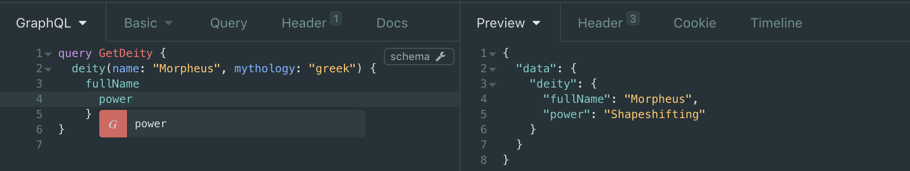

# Morpheus GraphQL [](https://hackage.haskell.org/package/morpheus-graphql) [](https://circleci.com/gh/morpheusgraphql/morpheus-graphql)

Build GraphQL APIs with your favourite functional language!

Morpheus GraphQL (Server & Client) helps you to build GraphQL APIs in Haskell with native haskell types.
Morpheus will convert your haskell types to a GraphQL schema and all your resolvers are just native Haskell functions. Mopheus GraphQL can also convert your GraphQL Schema or Query to Haskell types and validate them in compile time.

Morpheus is still in an early stage of development, so any feedback is more than welcome, and we appreciate any contribution!
Just open an issue here on GitHub, or join [our Slack channel](https://morpheus-graphql-slack-invite.herokuapp.com/) to get in touch.

## Getting Started

### Setup

To get started with Morpheus, you first need to add it to your project's dependencies, as follows (assuming you're using hpack):

package.yml

```yaml
dependencies:
  - morpheus-graphql
```

Additionally, you should tell stack which version to pick:

stack.yml

```yaml
resolver: lts-13.24

extra-deps:
  - megaparsec-7.0.5
  - aeson-1.4.4.0
  - time-compat-1.9.2.2
```

As Morpheus is quite new, make sure stack can find morpheus-graphql by running `stack update`

### Building your first GrqphQL API

### with GraphQL syntax and Haskell QuasiQuotes

```haskell

[gqlDocument|
  type Query {
    deity (uid: String!): Deity!
  }

  type Deity {
    name  : String!
    power : String
  }
|]

rootResolver :: GQLRootResolver IO () () Query () ()
rootResolver =
  GQLRootResolver {queryResolver = return Query {deity}, mutationResolver = pure (), subscriptionResolver = pure ()}
  where
    deity DeityArgs {uid} = pure Deity {name, power}
      where
        name _ = pure "Morpheus"
        power _ = pure (Just "Shapeshifting")

gqlApi :: ByteString -> IO ByteString
gqlApi = interpreter rootResolver
```

Template Haskell Generates types: `Query` , `Deity`, `DeityArgs`, that can be used by `rootResolver`

generated types are not compatible with `Mutation`, `Subscription`,
they can be used only in `Query`, but this issue will be fixed in next release

### with Native Haskell Types

To define a GraphQL API with Morpheus we start by defining the API Schema as a native Haskell data type,
which derives the `Generic` typeclass. Lazily resolvable fields on this `Query` type are defined via `a -> IORes b`, representing resolving a set of arguments `a` to a concrete value `b`.

```haskell
data Query = Query
  { deity :: DeityArgs -> IORes Deity
  } deriving (Generic)

data Deity = Deity
  { fullName :: Text         -- Non-Nullable Field
  , power    :: Maybe Text   -- Nullable Field
  } deriving (Generic)

instance GQLType Deity where
  type  KIND Deity = OBJECT

data DeityArgs = DeityArgs
  { name      :: Text        -- Required Argument
  , mythology :: Maybe Text  -- Optional Argument
  } deriving (Generic)
```

For each field in the `Query` type defined via `a -> IORes b` (like `deity`) we will define a resolver implementation that provides the values during runtime by referring to
some data source, e.g. a database or another API. Fields that are defined without `a -> IORes b` you can just provide a value.

In above example, the field of `DeityArgs` could also be named using reserved identities (such as: `type`, `where`, etc), in order to avoid conflict, a prime symbol (`'`) must be attached. For example, you can have:

```haskell
data DeityArgs = DeityArgs
  { name      :: Text        -- Required Argument
  , mythology :: Maybe Text  -- Optional Argument
  , type'     :: Text
  } deriving (Generic)
```

The field name in the final request will be `type` instead of `type'`. The Morpheus request parser converts each of the reserved identities in Haskell 2010 to their corresponding names internally. This also applies to selections.

```haskell
resolveDeity :: DeityArgs -> IORes Deity
resolveDeity args = gqlResolver $ askDB (name args) (mythology args)

askDB :: Text -> Maybe Text -> IO (Either String Deity)
askDB = ...
```

Note that the type `a -> IORes b` is just Synonym for `a -> ExceptT String IO b`

To make this `Query` type available as an API, we define a `GQLRootResolver` and feed it to the Morpheus `interpreter`. A `GQLRootResolver` consists of `query`, `mutation` and `subscription` definitions, while we omit the latter for this example:

```haskell
rootResolver :: GQLRootResolver IO () () Query () ()
rootResolver =
  GQLRootResolver
    { queryResolver = return Query {deity = resolveDeity}
    , mutationResolver = return ()
    , subscriptionResolver = return ()
    }

gqlApi :: ByteString -> IO ByteString
gqlApi = interpreter rootResolver
```

As you can see, the API is defined as `ByteString -> IO ByteString` which we can either invoke directly or use inside an arbitrary web framework
such as `scotty` or `serverless-haskell`. We'll go for `scotty` in this example:

```haskell
main :: IO ()
main = scotty 3000 $ post "/api" $ raw =<< (liftIO . gqlApi =<< body)
```

If we now send a POST request to `http://localhost:3000/api` with a GraphQL Query as body for example in a tool like `Insomnia`:

```GraphQL
query GetDeity {
  deity (name: "Morpheus") {
    fullName
    power
  }
}
```

our query will be resolved!

```JSON
{
  "data": {
    "deity": {
      "fullName": "Morpheus",
      "power": "Shapeshifting"
    }
  }
}
```

## Serverless Example

If you are interested in creating a `Morpheus GraphQL` API with `Serverless`, you should take a look at our example in this repository:
[_Mythology API_](https://github.com/morpheusgraphql/mythology-api) it is our example project build with `Morpheus GraphQL` and `Serverless-Haskell`,
where you can query different mythology characters with `GraphiQL`.

Mythology API is deployed on : [_api.morpheusgraphql.com_](https://api.morpheusgraphql.com) where you can test it with `GraphiQL`


## Advanced topics

### Enums

You can use Union Types as Enums, but they're not allowed to have any parameters.

```haskell
data City
  = Athens
  | Sparta
  | Corinth
  | Delphi
  | Argos
  deriving (Generic)

instance GQLType City where
  type KIND City = ENUM
```

### Union types

To use union type, all you have to do is derive the `GQLType` class. Using GraphQL [_fragments_](https://graphql.org/learn/queries/#fragments), the arguments of each data constructor can be accessed from the GraphQL client.

```haskell
data Character
  = DEITY Deity
  | HUMAN Human
  deriving (Generic)

instance GQLType Character where
  type KIND City = UNION
```

### Scalar types

To use custom scalar types, you need to provide implementations for `parseValue` and `serialize` respectively.

```haskell
data Odd = Odd Int  deriving (Generic)

instance GQLScalar Odd where
  parseValue (Int x) = pure $ Odd (...  )
  parseValue (String x) = pure $ Odd (...  )
  serialize  (Odd value) = Int value

instance GQLType Odd where
  type KIND Odd = SCALAR
```

### Applicative and Monad instance

The `Resolver` type has `Applicative` and `Monad` instances that can be used to compose resolvers.

### Introspection

Morpheus converts your schema to a GraphQL introspection automatically. You can use tools like `Insomnia` to take a
look at the introspection and validate your schema.
If you need a description for your GQLType inside of the introspection you can define the GQLType instance manually
and provide an implementation for the `description` function:

```haskell
data Deity = Deity
{ ...
} deriving (Generic)

instance GQLType Deity where
  description = const "A supernatural being considered divine and sacred"
```

screenshots from `Insomnia`





### Mutations

In addition to queries, Morpheus also supports mutations. The behave just like regular queries and are defined similarly:
Just exchange deriving `GQLQuery` for `GQLMutation` and declare them separately at the `GQLRootResolver` definition

```haskell
newtype Mutation = Mutation
  { createDeity :: Form -> IOMutRes Deity
  } deriving (Generic)

createDeityMutation :: Form -> IOMutRes Deity
createDeityMutation = ...

rootResolver :: GQLRootResolver IO Query Mutation ()
rootResolver =
  GQLRootResolver
    { queryResolver = return Query {...}
    , mutationResolver = return Mutation {
       createDeity = createDeityMutation
    }
    , subscriptionResolver = return ()
    }

gqlApi :: ByteString -> IO ByteString
gqlApi = interpreter rootResolver
```

### Subscriptions

im morpheus subscription and mutation communicating with Events,
`Event` consists with user defined `Channel` and `Content`.

every subscription has own Channel by which will be triggered

```haskell

data Channel
  = ChannelA
  | ChannelB

data Content
  = ContentA Int
  | ContentB Text

newtype Query = Query
  { deity :: () -> IORes Deity
  } deriving (Generic)

newtype Mutation = Mutation
  { createDeity :: () -> IOMutRes Channel Content Deity
  } deriving (Generic)

newtype Subscription = Subscription
  { newDeity :: () -> IOSubRes Channel Content Deity
  } deriving (Generic)

rootResolver :: GQLRootResolver IO Channel Content Query Mutation Subscription
rootResolver =
  GQLRootResolver
    { queryResolver = return Query {deity = const fetchDeity}
    , mutationResolver = return Mutation {createDeity}
    , subscriptionResolver = return Subscription {newDeity}
    }
  where
    fetchDeity = resolver $ dbDeity "" Nothing
    createDeity _args = toMutResolver [Event {channels = [ChannelA], content = ContentA 1}] fetchDeity
    newDeity _args = Event {channels = [ChannelA], content}
      where
        content (Event [ChannelA] (ContentA _value)) = resolver $ dbDeity "" Nothing -- resolve New State
        content (Event [ChannelA] (ContentB value))  = resolver $ dbDeity value Nothing -- resolve New State
        content _                                    = fetchDeity -- Resolve Old State
```

## Morpheus `GraphQL Client` with Template haskell QuasiQuotes

```haskell
defineByDocumentFile
    "./schema.gql"
  [gql|
    query GetHero ($byRealm: Realm)
      {
        deity (realm:$byRealm) {
          power
          fullName
        }
      }
  |]
```

will validate query and Generate:

- response type `GetHero`, `Deity` with `Lens` Instances
- input types: `GetHeroArgs` , `Realm`
- instance for `Fetch` typeClass

so that

```haskell
  fetchHero :: Args GetHero -> m (Either String GetHero)
  fetchHero = fetch jsonRes args
      where
        args = GetHeroArgs {byRealm = Just Realm {owner = "Zeus", surface = Just 10}}
        jsonRes :: ByteString -> m ByteString
        jsonRes = <GraphQL APi>
```

resolves well typed response `GetHero`.

except: `defineByDocumentFile` you can use:

```haskell
defineByIntrospectionFile "./introspection.json"
```

or

`defineByIntrospection` where you can directly connect it to server

## Morpheus CLI for Code Generating

Generating dummy Morpheus Api from `schema.gql`

```
morpheus build src/schem.gql src/GQLApi.hs
```

this command will generate Haskell API and resolvers,
resolvers will resolve default values for every object

# About

## The name

_Morpheus_ is the greek god of sleep and dreams whose name comes from the greek word _μορφή_ meaning form or shape.
He is said to be able to mimic different forms and GraphQL is good at doing exactly that: Transforming data in the shape
of many different APIs.

## Team

Morpheus is written and maintained by [_nalchevanidze_](https://github.com/nalchevanidze)

## Roadmap

- Medium future:
  - Stabilize API
  - Specification-isomorphic introspection
  - Specification-isomorphic error handling
- Long term:
  - Support all possible GQL features
  - Performance optimization
